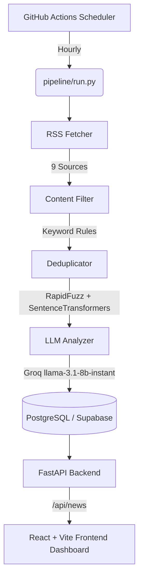

# AI-Powered Indian Stock Market News Intelligence Platform

> **Status:** Live & Deployed! All phases completed.

An automated, end-to-end news intelligence platform tailored for the Indian Stock Market. It fetches news from top Indian financial sources, intelligently filters out noise (crypto/forex), deduplicates overlapping articles using ML embeddings, analyzes sentiment and sectors using an LLM, and presents it in a beautiful, real-time React dashboard.

---

## Architecture Overview



---

## Tech Stack

| Layer | Technology | Why |
|---|---|---|
| **Scheduler** | GitHub Actions (cron) | Free, no server, version-controlled |
| **RSS Fetcher** | `feedparser` (Python) | Handles all 9 free Indian feeds |
| **Content Filter** | Keyword-based (Python) | Fast & cheap |
| **Deduplication** | RapidFuzz + SentenceTransformers | Local ML model, no API cost |
| **LLM** | Groq (`llama-3.1-8b-instant`) | Free tier, ultra-fast inference |
| **Backend** | FastAPI + SQLAlchemy | Async, typed, production-ready |
| **Database** | PostgreSQL via Supabase | Free 500MB cloud database |
| **Frontend** | React + Vite | Fast, modern component-based UI |
| **Frontend Hosting** | Vercel | Free, auto-deploys on push |
| **Backend Hosting** | Render | Free 500 hrs/month |

**Total cost: ₹0 / $0** (built entirely on robust free tiers)

---

## Live Deployment (Phase 9)

Follow these steps to deploy the full stack on the internet for free.

### 1. Database (Supabase)
1. Create a free account at [Supabase](https://supabase.com).
2. Create a New Project.
3. Once provisioned, go to **Project Settings → Database** and copy the **Connection string** (URI).
4. *Remember to replace `[YOUR-PASSWORD]` in the string with your actual database password!*
5. Update your GitHub Repository Secrets: change `DATABASE_URL` to this new Supabase connection string.

### 2. Backend API (Render)
1. Create a free account at [Render](https://render.com).
2. Click **New → Web Service**.
3. Connect your GitHub repository.
4. Set the **Build Command** to: `pip install -r backend/requirements.txt`
5. Set the **Start Command** to: `uvicorn backend.api.main:app --host 0.0.0.0 --port $PORT`
6. Under **Environment Variables**, add:
   - `DATABASE_URL`: (Your Supabase connection string)
   - `GROQ_API_KEY`: (Your Groq API Key)
   - `PYTHON_VERSION`: `3.11`
7. Click **Deploy**. Note the provided URL (e.g., `https://news-intel-backend.onrender.com`).

### 3. Frontend Dashboard (Vercel)
1. Create a free account at [Vercel](https://vercel.com).
2. Click **Add New → Project** and import your GitHub repository.
3. In the project configuration:
   - Set **Framework Preset** to `Vite`.
   - Set **Root Directory** to `frontend`.
4. Open the **Environment Variables** dropdown and add:
   - Name: `VITE_API_URL`
   - Value: `https://news-intel-backend.onrender.com/api` *(replace with your actual Render URL)*
5. Click **Deploy**! You will be given a public URL to view your live dashboard.

---

## Local Development Setup

If you prefer to run it locally, follow these steps:

### Prerequisites
- Python 3.11+
- Node.js 18+

### 1. Clone & enter the repo
```bash
git clone <repo-url>
cd news-intelligence
```

### 2. Backend Setup
```bash
# Create and activate virtual environment
python -m venv venv
venv\Scripts\activate  # Windows
# source venv/bin/activate # macOS/Linux

# Install dependencies
pip install -r backend/requirements.txt

# Start the API server (uses local SQLite by default)
uvicorn backend.api.main:app --reload
```

### 3. Frontend Setup
Open a new terminal window:
```bash
cd frontend
npm install
npm run dev
# Dashboard available at http://localhost:5173
```

---

## Environment Variables
See [`.env.example`](.env.example) for required variables.
- `GROQ_API_KEY`: Required for LLM analysis. Get one at [console.groq.com](https://console.groq.com)
- `DATABASE_URL`: Connection string (defaults to local SQLite if omitted)
- `VITE_API_URL`: Frontend pointer to the backend API

---

## Implementation Progress (Completed)

- [x] **Phase 0** — Project Setup & Repository Structure
- [x] **Phase 1** — Data Ingestion Layer (RSS Fetcher)
- [x] **Phase 2** — Processing Layer (Filter + Deduplication)
- [x] **Phase 3** — AI Analysis Layer (Groq LLM)
- [x] **Phase 4** — Storage Layer (SQLAlchemy ORM)
- [x] **Phase 5** — Backend API (FastAPI)
- [x] **Phase 6** — Frontend Dashboard (React + Vite)
- [x] **Phase 7** — GitHub Actions Scheduler
- [x] **Phase 8** — Integration & Testing
- [x] **Phase 9** — Deployment & Polish
